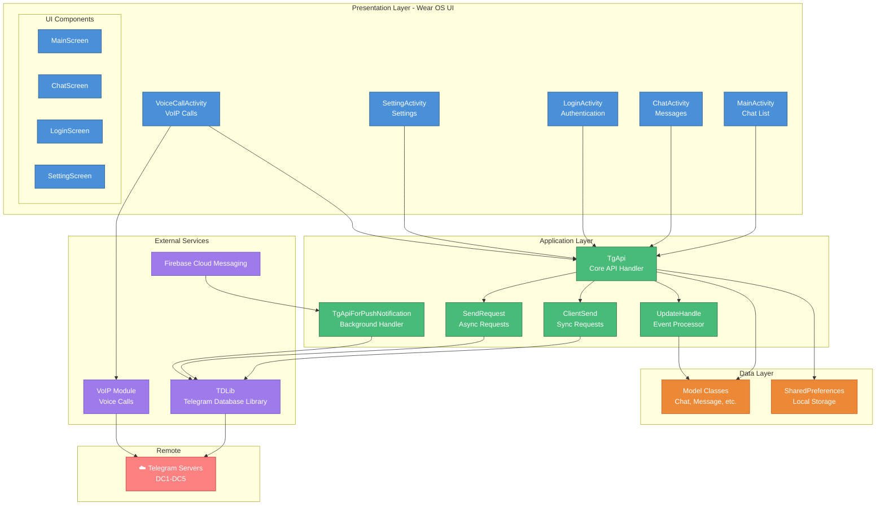
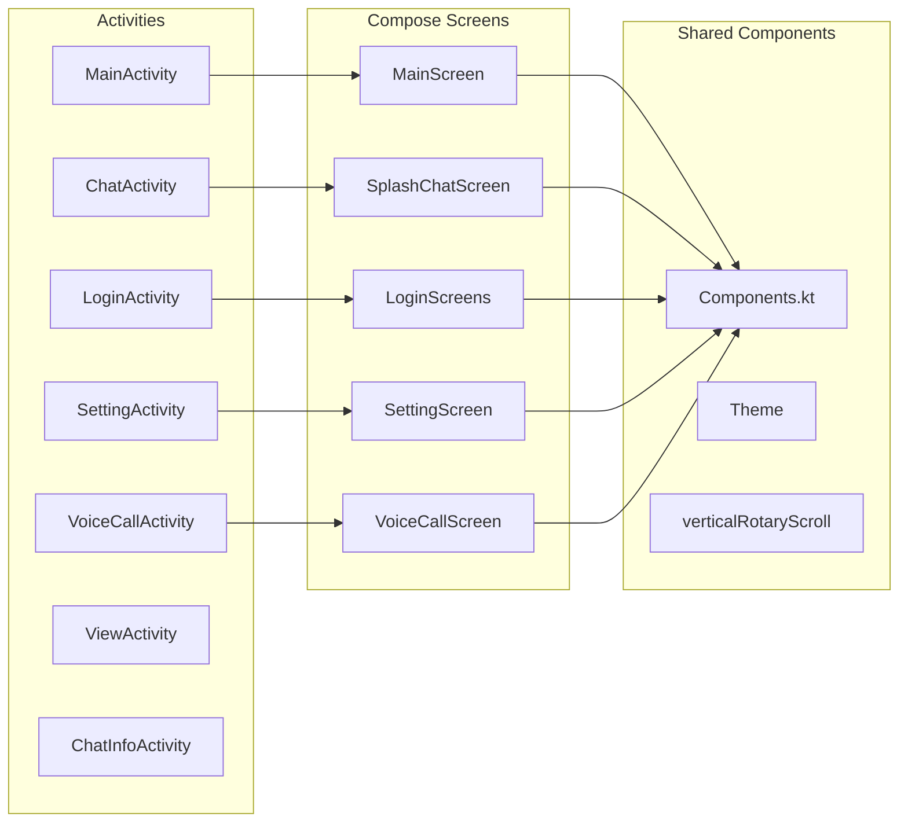
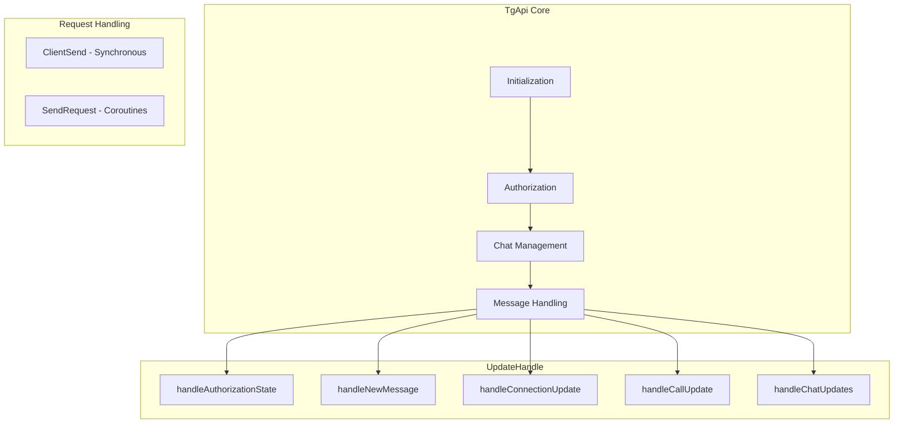
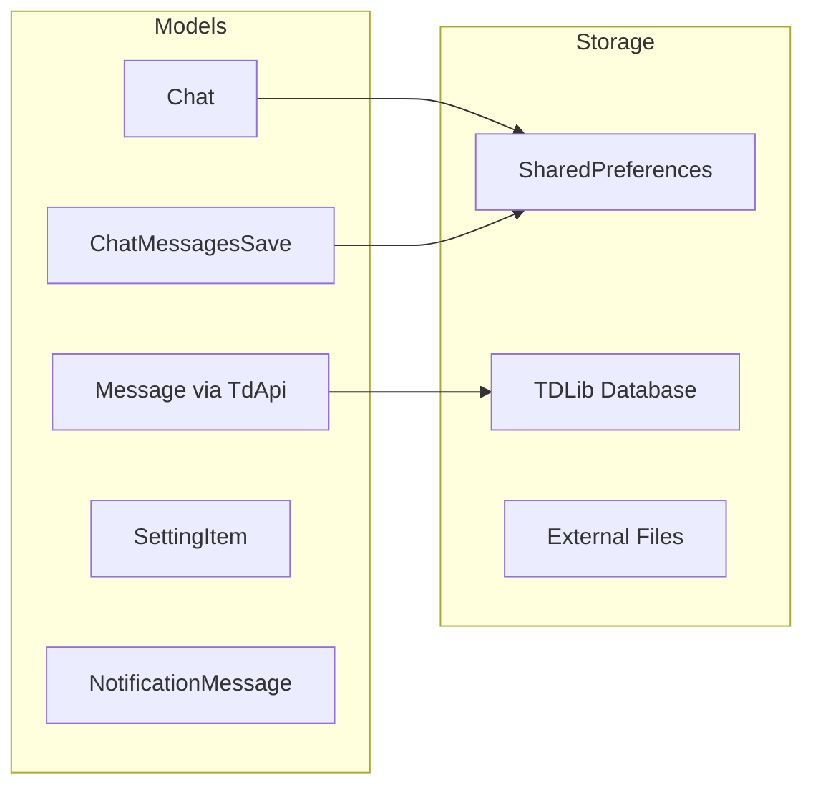
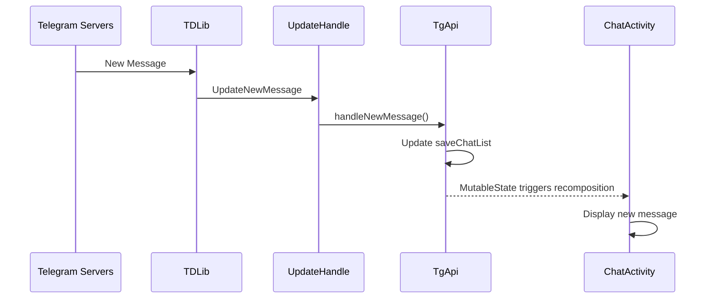
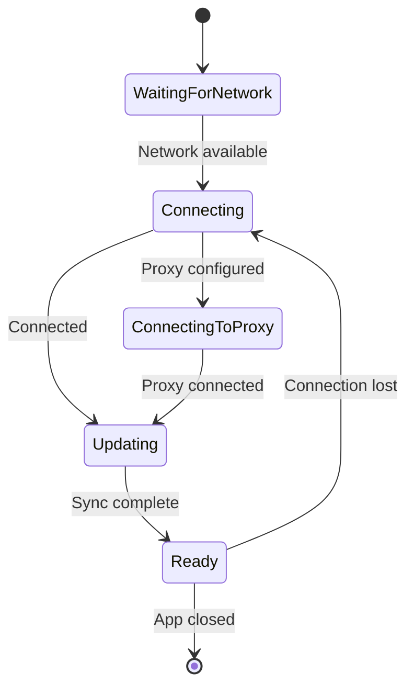
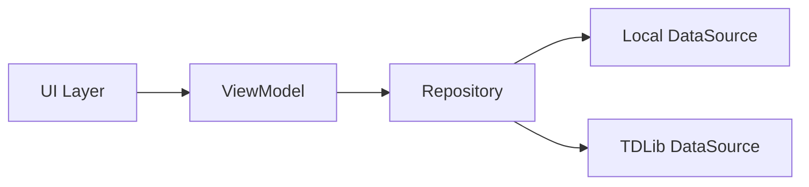
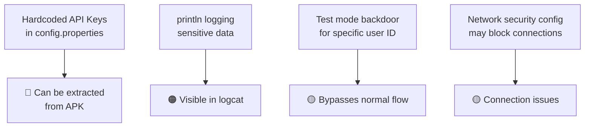

# TGwear Architecture Documentation

> **Generated:** 2026-02-01  
> **Project:** TGwear - Telegram Client for Wear OS  
> **Version:** Analysis based on current codebase

---

## Table of Contents

1. [Overview](#overview)
2. [Architecture Diagram](#architecture-diagram)
3. [Layer Breakdown](#layer-breakdown)
4. [Data Flow](#data-flow)
5. [Key Components](#key-components)
6. [Best Practices Analysis](#best-practices-analysis)
7. [Improvement Recommendations](#improvement-recommendations)
8. [Security Considerations](#security-considerations)

---

## Overview

TGwear is a standalone Telegram client designed specifically for Wear OS smartwatches. It uses **TDLib** (Telegram Database Library) for all Telegram protocol handling and features a **Jetpack Compose** UI optimized for round watch displays.

### Tech Stack

| Layer | Technology |
|-------|------------|
| **UI** | Jetpack Compose for Wear OS |
| **Language** | Kotlin (primary), Java (TDLib bindings, VoIP) |
| **Telegram Protocol** | TDLib (native C++ with JNI bindings) |
| **Push Notifications** | Firebase Cloud Messaging (FCM) |
| **Voice Calls** | VoIP module (from Challegram project) |
| **Min SDK** | Android 7.1+ (API 25) with Wear OS |

---

## Architecture Diagram



---

## Layer Breakdown

### 1. Presentation Layer (UI)



**Key Files:**

- `MainActivity.kt` - Entry point, chat list display
- `ChatActivity.kt` - Individual chat conversation
- `LoginActivity.kt` - Phone verification, 2FA, QR login
- `SettingActivity.kt` - App configuration
- `VoiceCallActivity.kt` - Voice call interface

### 2. Application Layer (Business Logic)



**Key Files:**

- `TgApi.kt` - Core Telegram client wrapper
- `UpdateHandle.kt` - TDLib event processor (1000+ lines)
- `ClientSend.kt` - Synchronous API operations
- `SendRequest.kt` - Coroutine-based async operations

### 3. Data Layer



---

## Data Flow

### Message Reception Flow



### Connection State Flow



---

## Key Components

### TgApiManager (Singleton)

```kotlin
object TgApiManager {
    var tgApi: TgApi? = null  // Global TgApi instance
}
```

### Connection State Handler

```kotlin
// UpdateHandle.kt - handleConnectionUpdate()
when (update.state.constructor) {
    ConnectionStateReady.CONSTRUCTOR -> topTitle.value = ""
    ConnectionStateConnecting.CONSTRUCTOR -> topTitle.value = "Connecting"
    ConnectionStateWaitingForNetwork.CONSTRUCTOR -> topTitle.value = "Offline"
}
```

---

## Best Practices Analysis

### ✅ What's Done Well

| Area | Implementation |
|------|----------------|
| **UI Architecture** | Uses Jetpack Compose with MutableState for reactive updates |
| **Coroutines** | Uses `lifecycleScope` for lifecycle-aware coroutines |
| **Error Handling** | Implements `CoroutineExceptionHandler` for crash recovery |
| **Theme Support** | Proper theming with `TGwearTheme` |
| **State Management** | Uses `mutableStateOf` for reactive UI updates |
| **Modularization** | Separates concerns (UI, API, Utils, Notifications) |

### ⚠️ Issues Found

| Severity | Issue | Location | Impact |
|----------|-------|----------|--------|
| 🔴 **Critical** | Hardcoded API credentials in assets | `config.properties` | Security vulnerability - credentials exposed in APK |
| 🔴 **Critical** | Static field leak annotations suppressed | `TgApiManager`, `ChatsListManager` | Memory leaks possible |
| 🟠 **High** | Excessive use of `runBlocking` | Multiple files (24+ occurrences) | Blocks main thread, ANR risk |
| 🟠 **High** | Console logging with `println` | 300+ occurrences throughout | Performance overhead, security risk |
| 🟠 **High** | Generic exception catching | 50+ `catch (e: Exception)` blocks | Swallows specific errors |
| 🟡 **Medium** | Test mode backdoor | `TgApi.kt:127` | Bypasses normal flow for specific user |
| 🟡 **Medium** | No dependency injection | Throughout | Tight coupling, hard to test |
| 🟡 **Medium** | Large monolithic files | `UpdateHandle.kt` (1000+ lines) | Hard to maintain |
| 🟢 **Low** | Mixed language in comments | Throughout | Chinese/English mix reduces readability |

---

## Improvement Recommendations

### 1. 🔒 Security Improvements (Critical)

#### 1.1 Remove Hardcoded API Credentials

**Current (Insecure):**

```properties
# config.properties
api_id=20508610
api_hash=dafae213c4ac948a2e24e80861b032c6
```

**Recommended:**

```kotlin
// Use BuildConfig or encrypted preferences
object ApiConfig {
    val apiId: Int
        get() = BuildConfig.TELEGRAM_API_ID
    
    val apiHash: String
        get() = EncryptedSharedPreferences
            .create(...)
            .getString("api_hash", null)
            ?: throw SecurityException("API hash not configured")
}
```

#### 1.2 Remove Test Mode Backdoor

```kotlin
// TgApi.kt:127 - REMOVE THIS:
if (user.id == 7513554495 && user.usernames?.activeUsernames[0] == "tgwear_review_bot") 
    isTestMode()
```

### 2. 🧵 Concurrency Improvements (High Priority)

#### 2.1 Replace `runBlocking` with Proper Coroutines

**Current (Problematic):**

```kotlin
val userInfo = runBlocking {
    tgApi?.getUser(chatId)
}
```

**Recommended:**

```kotlin
// Use LaunchedEffect in Compose
LaunchedEffect(chatId) {
    val userInfo = tgApi?.getUser(chatId)
    userInfoState.value = userInfo
}

// Or use suspend functions properly
suspend fun fetchUserInfo(chatId: Long): UserInfo? {
    return withContext(Dispatchers.IO) {
        tgApi?.getUser(chatId)
    }
}
```

#### 2.2 Fix Memory Leaks

**Current (Leaky):**

```kotlin
object TgApiManager {
    @SuppressLint("StaticFieldLeak")  // ⚠️ Suppressing the warning doesn't fix it!
    var tgApi: TgApi? = null
}
```

**Recommended:**

```kotlin
// Use Application-scoped dependency injection
class TGwearApplication : Application() {
    val tgApiManager: TgApiManager by lazy {
        TgApiManager(applicationContext)
    }
}

class TgApiManager(private val context: Context) {
    private var _tgApi: TgApi? = null
    val tgApi: TgApi? get() = _tgApi
    
    fun initialize() { /* ... */ }
    fun cleanup() { _tgApi = null }
}
```

### 3. 📝 Logging Improvements

#### 3.1 Replace println with Proper Logging

**Current:**

```kotlin
println("TgApi: Connecting")
println("Message deleted successfully")
```

**Recommended:**

```kotlin
// Create a centralized logger
object TgLog {
    private const val TAG = "TGwear"
    
    fun d(message: String) {
        if (BuildConfig.DEBUG) {
            Log.d(TAG, message)
        }
    }
    
    fun e(message: String, throwable: Throwable? = null) {
        Log.e(TAG, message, throwable)
        // Optionally report to Crashlytics
    }
}

// Usage
TgLog.d("Connecting to Telegram")
```

### 4. 🏗️ Architecture Improvements

#### 4.1 Implement Repository Pattern



```kotlin
interface ChatRepository {
    fun getChats(): Flow<List<Chat>>
    suspend fun sendMessage(chatId: Long, text: String): Result<Message>
    suspend fun markAsRead(chatId: Long, messageId: Long)
}

class ChatRepositoryImpl(
    private val tdLibDataSource: TdLibDataSource,
    private val localDataSource: LocalDataSource
) : ChatRepository {
    override fun getChats(): Flow<List<Chat>> = flow {
        // Emit cached data first, then fresh data
        emit(localDataSource.getCachedChats())
        val freshChats = tdLibDataSource.loadChats()
        localDataSource.cacheChats(freshChats)
        emit(freshChats)
    }
}
```

#### 4.2 Use ViewModels

```kotlin
class ChatViewModel(
    private val repository: ChatRepository,
    private val savedStateHandle: SavedStateHandle
) : ViewModel() {
    
    private val chatId = savedStateHandle.get<Long>("chatId") ?: 0L
    
    val messages = repository.getMessages(chatId)
        .stateIn(viewModelScope, SharingStarted.Lazily, emptyList())
    
    val connectionState = repository.connectionState
        .stateIn(viewModelScope, SharingStarted.Eagerly, ConnectionState.Connecting)
    
    fun sendMessage(text: String) {
        viewModelScope.launch {
            repository.sendMessage(chatId, text)
        }
    }
}
```

### 5. 🔋 Wear OS Specific Improvements

#### 5.1 Add Battery Optimization Exemption

```xml
<!-- AndroidManifest.xml -->
<uses-permission android:name="android.permission.REQUEST_IGNORE_BATTERY_OPTIMIZATIONS" />
```

```kotlin
// Request exemption for reliable background operation
fun requestBatteryOptimizationExemption(context: Context) {
    val pm = context.getSystemService(Context.POWER_SERVICE) as PowerManager
    if (!pm.isIgnoringBatteryOptimizations(context.packageName)) {
        val intent = Intent(Settings.ACTION_REQUEST_IGNORE_BATTERY_OPTIMIZATIONS).apply {
            data = Uri.parse("package:${context.packageName}")
        }
        context.startActivity(intent)
    }
}
```

#### 5.2 Implement Ambient Mode Support

```kotlin
class MainActivity : ComponentActivity(), AmbientModeSupport.AmbientCallbackProvider {
    
    private lateinit var ambientController: AmbientModeSupport.AmbientController
    
    override fun onCreate(savedInstanceState: Bundle?) {
        super.onCreate(savedInstanceState)
        ambientController = AmbientModeSupport.attach(this)
    }
    
    override fun getAmbientCallback() = object : AmbientModeSupport.AmbientCallback() {
        override fun onEnterAmbient(ambientDetails: Bundle?) {
            // Switch to low-power UI
        }
        
        override fun onExitAmbient() {
            // Restore full UI
        }
    }
}
```

### 6. 📦 Code Organization

#### 6.1 Split Large Files

```
Current:
  UpdateHandle.kt (1082 lines) 

Recommended:
  handlers/
    ├── AuthorizationHandler.kt
    ├── MessageHandler.kt
    ├── ConnectionHandler.kt
    ├── ChatHandler.kt
    ├── CallHandler.kt
    └── NotificationHandler.kt
```

#### 6.2 Use Sealed Classes for States

```kotlin
sealed class ConnectionState {
    object Ready : ConnectionState()
    object Connecting : ConnectionState()
    object ConnectingToProxy : ConnectionState()
    object Updating : ConnectionState()
    object WaitingForNetwork : ConnectionState()
    data class Error(val message: String) : ConnectionState()
}
```

---

## Security Considerations

### Current Vulnerabilities



### Recommended Security Measures

1. **API Credentials**: Use Android Keystore or encrypted BuildConfig
2. **Logging**: Remove all `println` statements, use production-safe logging
3. **Test Mode**: Remove or protect with proper flags
4. **Network Security**: Ensure Telegram servers are reachable
5. **Code Obfuscation**: Enable R8/ProGuard for release builds

---

## File Structure

```
TGwear/
├── app/
│   └── src/main/
│       ├── java/com/gohj99/tgwear/
│       │   ├── *.kt                    # Activities (26 files)
│       │   ├── model/                  # Data classes (7 files)
│       │   │   ├── Chat.kt
│       │   │   ├── Message.kt
│       │   │   └── ...
│       │   ├── ui/                     # Compose UI (36 files)
│       │   │   ├── chat/
│       │   │   ├── main/
│       │   │   ├── setting/
│       │   │   └── theme/
│       │   └── utils/
│       │       ├── telegram/           # TDLib wrapper (5 files)
│       │       │   ├── TgApi.kt
│       │       │   ├── UpdateHandle.kt
│       │       │   ├── ClientSend.kt
│       │       │   ├── SendRequest.kt
│       │       │   └── Utils.kt
│       │       └── notification/       # FCM handling (5 files)
│       │           ├── TgApiForPushNotification.kt
│       │           ├── TdFirebaseMessagingService.kt
│       │           └── ...
│       ├── assets/
│       │   └── config.properties       # ⚠️ Contains API keys
│       └── res/
├── libtd/                              # TDLib Java bindings
│   └── src/main/java/org/drinkless/tdlib/
│       ├── Client.java
│       └── TdApi.java                  # 3.8MB - Generated API
└── docs/
    └── ARCHITECTURE.md                 # This file
```

---

## Summary

### Priority Action Items

| Priority | Action | Effort | Impact |
|----------|--------|--------|--------|
| 1 | Remove hardcoded API credentials | Low | Critical |
| 2 | Replace `runBlocking` with coroutines | Medium | High |
| 3 | Fix memory leak in TgApiManager | Medium | High |
| 4 | Replace println with proper logging | Low | Medium |
| 5 | Add ViewModel layer | High | High |
| 6 | Split UpdateHandle.kt | Medium | Medium |
| 7 | Add Wear OS ambient mode | Medium | Medium |
| 8 | Implement dependency injection | High | High |

---

*This document was generated by analyzing the TGwear codebase. For questions or updates, refer to the source code.*
